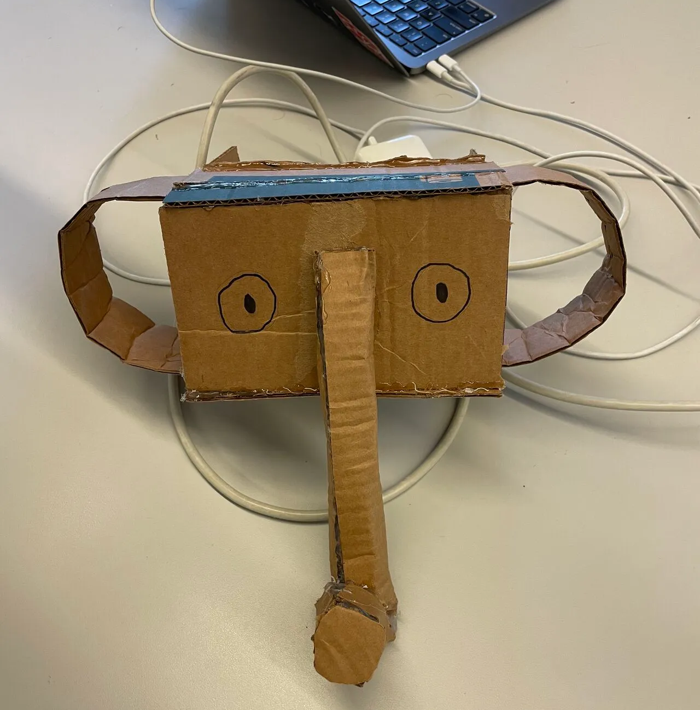

# FLOW - VR Meditation Experience

<div align="center">
  
  <p><em>Experience VR meditation with an affordable cardboard headset</em></p>
</div>

## Overview

FLOW is a mobile VR meditation application that brings immersive meditation experiences to users through affordable cardboard headsets. The project combines modern web technologies with mobile development to create accessible VR experiences.

## Technical Stack

- **Frontend**: Flutter (Mobile App)
- **VR Framework**: A-Frame & Three.js
- **Backend**: Firebase (Firestore, Storage, Realtime Database)
- **AI Integration**: 
  - GPT-3.5 (Yes, this is an old project) for guided meditation scripts
  - MVDiffusion for 3D scene generation
- **Audio**: Google Cloud Text-to-Speech API

## Key Features

### 1. Customizable Meditation Scenes
```dart
// Scene generation using A-Frame
<a-scene>
    <a-assets>
        
        
    </a-assets>
    <a-camera stereocam="eye: right"></a-camera>
    <a-sky src="#left" rotation="0 -90 0" stereo="eye: left"></a-sky>
    <a-sky src="#right" rotation="0 -90 0" stereo="eye: right"></a-sky>
</a-scene>
```

### 2. AI-Powered Meditation Guidance
```dart
Future<String?> _chatGpt3Example(String myPrompt, int time) async {
    final request = ChatCompleteText(
        messages: [Messages(role: Role.user, content: myPrompt)],
        model: GptTurboChatModel(),
        maxToken: time == 1 ? 800 : 2000
    );
    // ... GPT-3.5 implementation
}
```

### 3. Real-time Multiplayer Support
```dart
// Firebase integration for multiplayer sessions
final docRef = _firestore.collection('game sessions').doc(gamecode);
await docRef.update({
    'image url': imageUrl,
    'audio url': audioUrl
});
```

## Getting Started

1. Clone the repository
2. Install Flutter dependencies:
   ```bash
   flutter pub get
   ```
3. Configure Firebase:
   - Add your Firebase configuration to `firebase_options.dart`
4. Run the application:
   ```bash
   flutter run
   ```

## Project Structure

```
lib/
├── main.dart                 # Application entry point
├── providers/               # State management
├── screen/                  # UI components
│   ├── Create/             # Session creation
│   ├── Join/               # Session joining
│   └── session_page.dart   # Session management
└── html_generator.dart      # VR scene generation
```

## Demo

[](https://youtu.be/74_JeCkNjLk)

## Requirements

- Flutter SDK
- Firebase account
- Google Cloud credentials
- Cardboard-compatible headset

## License

This project is licensed under the MIT License - see the LICENSE file for details.
